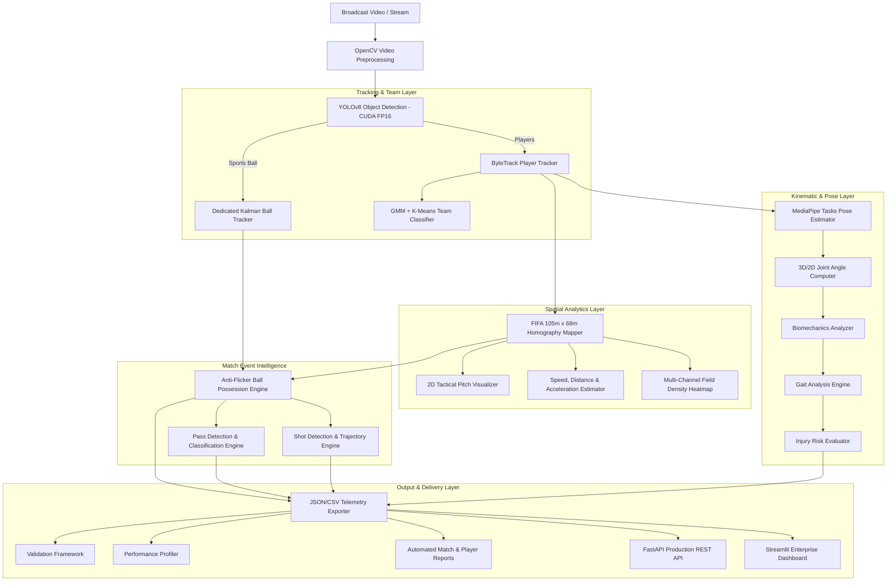

# StepOut AI Football Analytics Platform — Technical Architecture & System Documentation

The **StepOut AI Football Analytics Platform** is an enterprise-grade Computer Vision and Match Intelligence platform designed to match the capabilities of industry leaders (Hudl, Stats Perform, Wyscout, Catapult, StepOut).

---

## 1. System Architecture Diagram



---

## 2. Directory & Package Structure

```text
d:\stepout\
├── config.yaml                    # Central YAML Configuration File
├── streamlit_app.py               # Streamlit Enterprise Multi-Page Dashboard
├── logs/                          # Centralized Log Directory
│   ├── pipeline.log               # Execution telemetry & module runtimes
│   └── errors.log                 # Warnings and stack traces
├── docs/                          # System Documentation
│   └── ARCHITECTURE.md            # System Architecture & Developer Guide
├── tests/                         # Automated Test Suite
│   ├── test_config.py             # Config loader unit tests
│   ├── test_analytics.py          # Possession, Pass, Shot unit tests
│   └── test_pipeline.py           # Integration test suite
├── outputs/                       # Rendered Video & Telemetry Artifacts
│   ├── tracking.mp4               # Annotated Tracking Stream + HUD Banners
│   ├── pitch_view.mp4             # 2D Tactical Top-Down Pitch Canvas
│   ├── detection.mp4              # Raw YOLO Detection Video
│   ├── team_classification.mp4    # Team BBox Overlay Video
│   ├── heatmap.png                # Multi-channel Density Heatmap
│   ├── analytics.json             # Match Summary Telemetry
│   ├── pass_events.json           # Pass Event History Log
│   ├── pass_summary.json          # Pass Statistics & Accuracy
│   ├── shot_events.json           # Shot Event History Log
│   ├── shot_summary.json          # Shot Statistics Summary
│   ├── ball_possession.json       # Per-frame Possession Telemetry
│   ├── team_possession_summary.json# Team Possession Percentage Split
│   ├── validation_report.json     # Pipeline Quality Validation Report
│   ├── performance_report.json    # Module Runtime Profiler Report
│   └── match_report.html          # Automated HTML Printable Report
└── app/
    ├── core/                      # Core System Packages
    │   ├── config.py              # Configuration Manager (ConfigManager)
    │   └── logging_config.py      # Central Logger Setup
    ├── analytics/                 # Tactical & Event Analytics Engines
    │   ├── ball_possession.py     # Anti-Flicker Ball Possession Engine
    │   ├── pass_detector.py       # Pass Detector & Tactical Classifier
    │   ├── shot_detector.py       # Shot Detector & Goal Alignment Engine
    │   ├── validation.py          # Pipeline Validation Framework
    │   ├── heatmap_generator.py   # Gaussian Density Heatmap Generator
    │   ├── speed_estimator.py     # Real-World Speed Estimator (km/h)
    │   ├── distance_tracker.py    # Cumulative Distance Tracker (meters)
    │   └── acceleration_estimator.py # Acceleration Estimator (m/s²)
    ├── homography/                # Homography & Pitch Mapping
    │   ├── field_config.py        # FIFA Pitch Dimensions (105m x 68m)
    │   ├── homography_utils.py    # Perspective Transformation Matrices
    │   ├── pitch_mapper.py        # Pixel-to-Pitch Spatial Mapping
    │   └── visualize_pitch.py     # 2D Tactical Top-Down Renderer
    ├── tracking/                  # Object Tracking
    │   ├── ball_tracker.py        # Dedicated Kalman Ball Tracker
    │   └── bytetrack_custom.yaml  # ByteTrack Hyperparameters
    ├── pose/                      # Pose & Kinematic Intelligence
    │   ├── pose_estimator.py      # MediaPipe Landmark Estimator
    │   ├── joint_angles.py        # Joint Angle Trigonometry
    │   ├── biomechanics.py        # Kinetic Energy & Symmetry
    │   ├── gait_analysis.py       # Gait Cadence & Symmetry
    │   ├── injury_risk.py         # Biomechanical Load & Risk Scoring
    │   └── pose_pipeline.py       # Integrated Kinematic Pipeline
    ├── api/                       # REST API Backend Services
    │   └── main.py                # FastAPI Service & OpenAPI Docs
    ├── reports/                   # Report Generation
    │   └── report_generator.py    # HTML, CSV, and JSON Report Exporter
    └── utils/                     # Utility Classes
        └── profiler.py            # Hardware & Runtime Profiler
```

---

## 3. API Documentation (`FastAPI`)

Start server:
```bash
python -m uvicorn app.main:app --reload --port 8000
```
Interactive Swagger Documentation available at `http://localhost:8000/docs`.

| Endpoint | Method | Description |
|---|---|---|
| `GET /` | `GET` | Health check & system status |
| `POST /analyze` | `POST` | Trigger match video analysis pipeline |
| `GET /analytics` | `GET` | Retrieve complete match analytics summary |
| `GET /players` | `GET` | Retrieve individual player performance metrics |
| `GET /teams` | `GET` | Retrieve team possession & passing breakdown |
| `GET /passes` | `GET` | Retrieve list of all detected pass events |
| `GET /shots` | `GET` | Retrieve list of all detected shot events |
| `GET /heatmaps` | `GET` | Serve rendered field density heatmap image |
| `GET /report` | `GET` | Retrieve validation & performance profiler reports |

---

## 4. Streamlit Dashboard Guide

Start dashboard:
```bash
streamlit run streamlit_app.py
```
Pages:
- **Home**: Hardware Status (GPU/CPU), Video Ingestion, System Readiness.
- **Match Overview**: Possession %, Passes, Shots, Field Heatmap.
- **Player Analytics**: Player Track ID Selector, Speed/Distance/Accel, Biomechanics Pose Overlay.
- **Team Analytics**: Red vs. Blue Passing & Tactical Comparison.
- **Match Timeline**: Chronological Filterable Event Log.
- **Video Player**: Native Video Player for `tracking.mp4`, `pitch_view.mp4`, `detection.mp4`.
- **Downloads**: One-click downloads for JSON reports, CSVs, and output videos.

---

## 5. Developer Guide & Test Suite

Run automated unit and integration tests:
```bash
python -m unittest discover -s tests
```

Execute full match analysis pipeline:
```bash
python scripts/run_match_analysis.py
```
